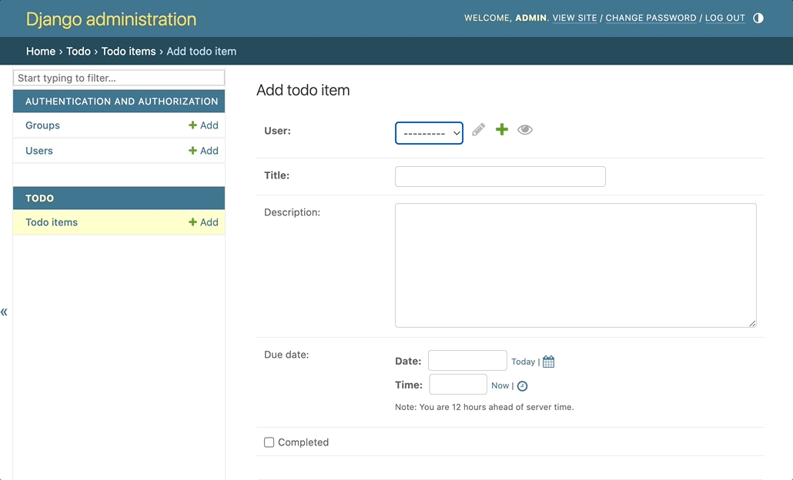

<a name="readme-top"></a>


<div align="center">
<!-- Title: -->
<h1><a href="https://github.com/skthati/TODO_Django_React.git">TODO</a> - Django - React </h1>
</div>

<!-- Table of contents -->
<hr>
<hr>
<ol>
    <li><a href="#todo-django">TODO Django React</a></li>
    <li><a href="#install-django">Install Django </a></li>
    <li><a href="#todo-model">ToDo Model </a></li>
    <li><a href="#serializer">Serializer </a></li> 
    <li><a href="#views">Views </a></li>
    <li><a href="#urls">URLs </a></li> 
    <li><a href="#cors">Cors </a></li> 
    <li><a href="#super-user">Super User </a></li>
    <li><a href="#register-app">Register App </a></li>
    <li><a href="#install-react">Install React </a></li>
    <li><a href="#todo-componenet"> Todo Component </a></li>

</ol>
<hr>
<hr>

# TODO App<a name="todo-django"></a>
 Basic TODO app.

 id, title, completed/not completed.

```React
[
    {id:1, title: 'Buy Milk', completed: true },
    {id:2, title: 'Read Book', completed: false}
]
```





<p align="right">(<a href="#readme-top">back to top</a>)</p>
<hr>  

# Install Django and TODO app<a name="install-django"></a>

<ol>
    <li>Create two folders `backend` and `frontend`. </li>
    <li>Open terminal and go to backend folder 'cd backend'. </li>
    <li>Install virtual env `python3 -m pip install virtualenv` </li>
    <li>Go to env `python3 -m virtualenv env`</li>
    <li>Activate virtual env `source env/bin/activate`</li>
    <li>Install Django 'python3 -m pip install django'</li>
    <li>Start project `django-admin startproject mytodo`</li>
    <li>cd mytodo</li>
    <li>python manage.py startapp todo</li>


</ol>

<p align="right">(<a href="#readme-top">back to top</a>)</p>
<hr>  

# ToDo Model<a name="todo-model"></a>

In `todo/model.py` define the model.
```Python
from django.db import models
from django.contrib.auth.models import User

class TodoItem(models.Model):
    user = models.ForeignKey(User, on_delete=models.CASCADE)
    title = models.CharField(max_length=200)
    description = models.TextField(blank=True, null=True)
    due_date = models.DateTimeField(blank=True, null=True)
    completed = models.BooleanField(default=False)
    created_at = models.DateTimeField(auto_now_add=True)
    updated_at = models.DateTimeField(auto_now=True)

    def __str__(self):
        return self.title
    

```

Now do migrations.

```bash
python manage.py makemigrations
python manage.py migrate
```

### Setup Django REST Framework

```bash
pip install djangorestframework
```
Add `rest_framework`, `todo` to `INSTALLED_APPS` in `mytodo/settings.py`.

<p align="right">(<a href="#readme-top">back to top</a>)</p>
<hr>  


# Serializer<a name="serializer"></a>

Create a new python file in todo folder and name it serializer.py

```Python
//todo/serializer.py

from rest_framework import serializers
from .models import TodoItem

class TodoItemSerializer(serializers.ModelSerializer):
    class Meta:
        model = TodoItem
        fields = '__all__'

```


<p align="right">(<a href="#readme-top">back to top</a>)</p>
<hr>  

# Views<a name="views"></a>

In todo/views.py

```Python
//todo/serializer.py

from rest_framework import viewsets
from django.shortcuts import render
from rest_framework import viewsets
from .models import TodoItem
from .serializer import TodoItemSerializer

class TodoViewSet(viewsets.ModelViewSet):
    queryset = TodoItem.objects.all()
    serializer_class = TodoItemSerializer

```


<p align="right">(<a href="#readme-top">back to top</a>)</p>
<hr>  

# URLs<a name="urls"></a>

In todo/urls.py

```Python
//todo/urls.py
from django.urls import path, include
from rest_framework.routers import DefaultRouter
from .views import TodoViewSet

router = DefaultRouter()
router.register(r'todo', TodoViewSet)

urlpatterns = [
    path('', include(router.urls)),
]


```

In mytodo/urls.py

```Python

from django.contrib import admin
from django.urls import path, include

urlpatterns = [
    path('admin/', admin.site.urls),
    path('api/', include('todo.urls')),
]

```


<p align="right">(<a href="#readme-top">back to top</a>)</p>
<hr>  


# Cors<a name="cors"></a>

Install Cors and configure it

```bash
pip install django-cors-headers
```

add `corsheaders` in `Installed_apps` and middleware in `settings.py`


<p align="right">(<a href="#readme-top">back to top</a>)</p>
<hr>  

# Run Server 

```bash
python3 manage.py runserver
```

# Super User<a name="super-user"></a>

```bash
python manage.py createsuperuser
```


<p align="right">(<a href="#readme-top">back to top</a>)</p>
<hr>  

# Register App<a name="registerapp"></a>

Open todo/admin.py

```Python
from django.contrib import admin
from .models import TodoItem

# Register your models here.
admin.site.register(TodoItem)
```


<p align="right">(<a href="#readme-top">back to top</a>)</p>
<hr>  

# Install React<a name="install_react"></a>

Open new terminal and go to the folder frontend to create React App.

```bash
cd frontend

# Create React app with todoapp name
npx create-react-app todoapp
cd todoapp

#Bundle the app into static files for production
npm run build

#start the server
npm start

# Install Axios 
npm install axios


```

# Todo Componenet <a name="todo_component"></a>

Write below code in `src/components/TodoApp.js

```React
import React, { useState, useEffect } from 'react'
import axios from 'axios'

const TodoApp = () => {
    const [allTodo, SetAllTodo] = useState([]);
    const [newTodo, SetNewTodo] = useState("");

    useEffect(() => {
        axios.get('http://localhost:8000/api/todo/')
        .then(response => SetAllTodo(response.data))
        .catch(error => console.error('Error fetching All todo', error));
    }, []);

    const handleAddTodo = () => {
        axios.post('http://localhost:8000/api/todo/', {title: newTodo})
        .then(response => SetAllTodo([...allTodo, response.data]))
        .catch(error => console.error('Error adding todo', error));
        SetNewTodo("");
    }

    const handleCompleteTodo = (id) => {
        axios.patch(`http://localhost:8000/api/todo/${id}/`, {completed: true})
        .then(response => {
            SetAllTodo(allTodo.map(e => (e.id === id ? response.data : e)));
        })
        .catch(error => console.error('Error marking the item to complete', error));
    };

    return (
        <div>
            <h1> ToDo </h1>

            <input
                type="text"
                value={newTodo}
                onChange={(e) => SetNewTodo(e.target.value)}
                placeholder='New Todo'
            />

            <button onClick={handleAddTodo}>Add ToDo</button>

            <ul>
                {allTodo.map(todo => (
                    <li key={todo.id}>
                        <span> {todo.title } </span>
                        <button onClick={() => handleCompleteTodo(todo.id)}>
                            {todo.completed ? 'Completed' : 'Complete'}
                        </button>
                    </li>
                ))}
            </ul>
        </div>
    );
} ;

export default TodoApp;
```


<p align="right">(<a href="#readme-top">back to top</a>)</p>
<hr>  

# Update app.js

```React
import logo from './logo.svg';
import './App.css';
import TodoApp from './components/TodoApp';

function App() {
  return (
    <div className="App">
      <TodoApp />
    </div>
  );
}

export default App;

```

<p align="right">(<a href="#readme-top">back to top</a>)</p>
<hr>  
